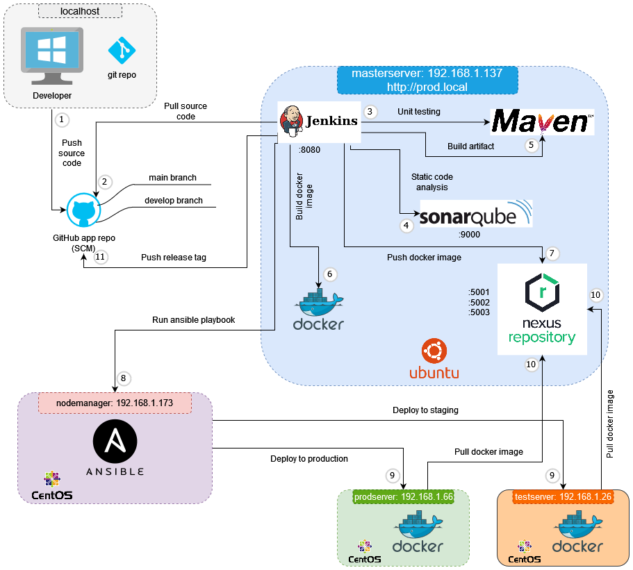

# Application Spring Boot pour le cours DevOps

Ce dépôt contient le code source de l'application Spring Boot utilisée dans le cadre du cours [Mettez en place un pipeline CI/CD DevOps complet dans un environnement Windows/Linux avec Jenkins, SonarQube, Nexus, Docker et Ansible](https://mossaabfrifita.github.io/docs/category/devops-cicd-pipeline).

